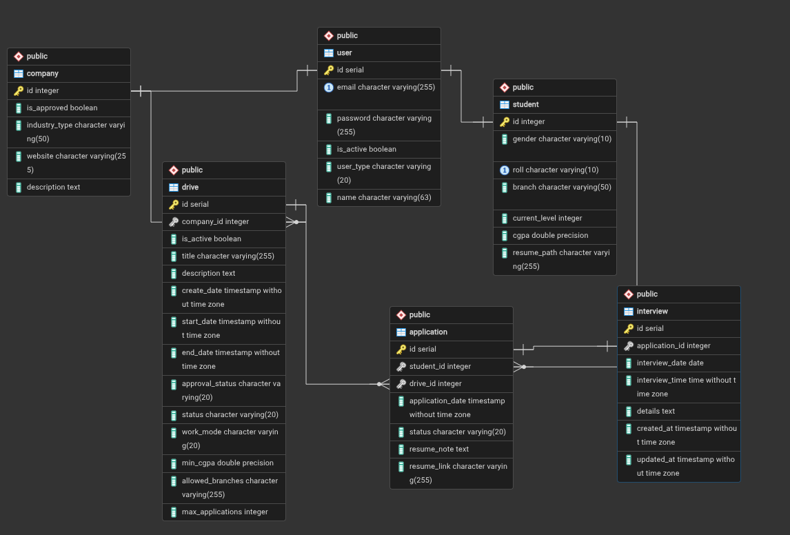

# BS STUDENT PLACEMENT PORTAL

Hello and welcome to the BS Student Placement Portal! This is a comprehensive platform designed to facilitate the placement process for students, companies, and administrators. Below is an overview of the features and API endpoints available in the portal.

## Student Features

- View and update profile
- View available drives and company details
- Apply to drives and track application status
- Export applications data
- Automatic reminders for students to apply to drives.

## Company Features

- Create and manage drives
- View and update company profile
- View applications and update their status
- Schedule interviews and send notifications to students by email.
- View drive summaries and application details

## Admin Features

- Approve or block companies and drives
- View dashboard with statistics
- View and manage applications, companies, drives, and students
- View pending companies and drives
- Reject or unblock companies, drives, and students
- Automatic montly reports for admin to review the portal's performance and identify areas for improvement.

## System Features

- Strong authentication and authorization: redis based session, argon2 password hashing, OTP based password reset
- Asynchronous tasks for long-running operations like exporting applications data
- Strong Database constraints and relationships to ensure data integrity

## API Endpoints

| Endpoint | Methods | Rule |
|----------|---------|------|
| api.admin.application_detail | GET | /api/admin/applications/<int:application_id>/ |
| api.admin.application_resume | GET | /api/admin/applications/<int:application_id>/resume/ |
| api.admin.approve_company | PUT | /api/admin/companies/<int:company_id>/approve/ |
| api.admin.approve_drive | PUT | /api/admin/drives/<int:drive_id>/approve/ |
| api.admin.block_company | PUT | /api/admin/companies/<int:company_id>/block/ |
| api.admin.block_drive | PUT | /api/admin/drives/<int:drive_id>/block/ |
| api.admin.block_student | PUT | /api/admin/students/<int:student_id>/block/ |
| api.admin.dashboard | GET | /api/admin/dashboard/ |
| api.admin.drive_detail | GET | /api/admin/drives/<int:drive_id>/ |
| api.admin.list_applications | GET | /api/admin/applications/ |
| api.admin.list_companies | GET | /api/admin/companies/ |
| api.admin.list_drives | GET | /api/admin/drives/ |
| api.admin.list_students | GET | /api/admin/students/ |
| api.admin.pending_companies | GET | /api/admin/companies/pending/ |
| api.admin.pending_drives | GET | /api/admin/drives/pending/ |
| api.admin.reject_company | PUT | /api/admin/companies/<int:company_id>/reject/ |
| api.admin.reject_drive | PUT | /api/admin/drives/<int:drive_id>/reject/ |
| api.admin.unblock_company | PUT | /api/admin/companies/<int:company_id>/unblock/ |
| api.admin.unblock_drive | PUT | /api/admin/drives/<int:drive_id>/unblock/ |
| api.admin.unblock_student | PUT | /api/admin/students/<int:student_id>/unblock/ |
| api.auth.forgot_password | POST | /api/auth/send-otp/ |
| api.auth.index | GET | /api/auth/ |
| api.auth.login_user | POST | /api/auth/login/ |
| api.auth.logout_user | POST | /api/auth/logout/ |
| api.auth.register_company | POST | /api/auth/register/company/ |
| api.auth.register_user | POST | /api/auth/register/student/ |
| api.auth.reset_password | POST | /api/auth/reset-password/ |
| api.brances_alias | GET | /api/brances |
| api.branches | GET | /api/branches |
| api.company.company_summary | GET | /api/company/summary/ |
| api.company.create_drive | POST | /api/company/drives/create/ |
| api.company.delete_drive | DELETE | /api/company/drives/<int:drive_id>/delete/ |
| api.company.drive_summaries | GET | /api/company/drives/summary/ |
| api.company.drive_summary | GET | /api/company/drives/<int:drive_id>/summary/ |
| api.company.list_company_applications | GET | /api/company/applications/ |
| api.company.update_application_status | PUT | /api/company/applications/<int:application_id>/status/ |
| api.company.update_drive | PUT | /api/company/drives/<int:drive_id>/update/ |
| api.company.update_profile | PUT | /api/company/profile/update/ |
| api.company.view_application | GET | /api/company/applications/<int:application_id>/ |
| api.company.view_application_resume | GET | /api/company/applications/<int:application_id>/resume/ |
| api.company.view_drive_applications | GET | /api/company/drives/<int:drive_id>/ |
| api.company.view_drives | GET | /api/company/drives/ |
| api.company.view_profile | GET | /api/company/profile/ |
| api.enums | GET | /api/enums |
| api.genders | GET | /api/genders |
| api.index | GET | /api/ |
| api.industries | GET | /api/industries |
| api.student.apply_to_drive | POST | /api/student/drives/<int:drive_id>/apply/ |
| api.student.export_applications | POST | /api/student/applications/export/ |
| api.student.export_applications_download | GET | /api/student/applications/export/<string:task_id>/download |
| api.student.export_applications_status | GET | /api/student/applications/export/<string:task_id>/status |
| api.student.update_profile | PUT | /api/student/profile/update/ |
| api.student.view_application_detail | GET | /api/student/applications/<int:application_id>/ |
| api.student.view_applications | GET | /api/student/applications/ |
| api.student.view_available_drives | GET | /api/student/drives/ |
| api.student.view_company_detail | GET | /api/student/companies/<int:company_id>/ |
| api.student.view_drive_detail | GET | /api/student/drives/<int:drive_id>/ |
| api.student.view_profile | GET | /api/student/profile/ |
| api.student.view_profile_resume | GET | /api/student/profile/resume/ |
| api.user_types | GET | /api/user-types |
| static | GET | /static/<path:filename> |


## Technologies Used

- Python
- Flask
- SQLAlchemy
- Celery
- Redis
- SQLite3
- Vue.js
- HTML/CSS
- Js Libraries: Axios, vue3-Toastify, PiniaStore, Vue-Router
- PNPM: Node Package Manager
- UV: Python package manager

## Installation and Setup

1. Clone the repository
2. Install python3, uv and PNPM
3. Inside the project directory, run `uv sync` to install the required python packages
4. Run `pnpm install` inside the `frontend` directory to install the required node packages
5. From the root directory, run `./devstack.sh` to start the development server
6. Access the application at `http://localhost:5173/`.
7. To stop the development server, just press `Ctrl+C` in the terminal where the server is running.

## Project Structure

```bash
himanshu@fedora 23f2001665. $ tree
.
└── bs-student-placement-portal-main
    ├── backend
    │   ├── application
    │   │   ├── data_seed.py
    │   │   ├── errors.py
    │   │   ├── __init__.py
    │   │   ├── models.py
    │   │   ├── routes
    │   │   │   ├── admin.py
    │   │   │   ├── auth.py
    │   │   │   ├── common.py
    │   │   │   ├── company.py
    │   │   │   ├── __init__.py
    │   │   │   └── student.py
    │   │   ├── services
    │   │   │   ├── cache.py
    │   │   │   ├── __init__.py
    │   │   │   └── otp.py
    │   │   └── templates
    │   │       └── emails
    │   │           ├── daily_digest.html
    │   │           └── monthly_activity_report.html
    │   ├── app.py
    │   ├── celery_worker.py
    │   ├── config.py
    │   ├── extensions.py
    │   ├── __init__.py
    │   └── tasks
    │       ├── export.py
    │       ├── schedules.py
    │       └── send_email.py
    ├── devstack.sh
    ├── frontend
    │   ├── index.html
    │   ├── package.json
    │   ├── pnpm-lock.yaml
    │   ├── public
    │   │   ├── favicon.svg
    │   │   └── icons.svg
    │   ├── src
    │   │   ├── api
    │   │   │   ├── admin.js
    │   │   │   ├── auth.js
    │   │   │   ├── client.js
    │   │   │   ├── company.js
    │   │   │   └── student.js
    │   │   ├── App.vue
    │   │   ├── assets
    │   │   │   └── theme.css
    │   │   ├── components
    │   │   │   └── admin
    │   │   │       ├── AdminPageHeader.vue
    │   │   │       ├── AdminPagination.vue
    │   │   │       └── DriveListPanel.vue
    │   │   ├── layouts
    │   │   │   ├── AdminLayout.vue
    │   │   │   ├── AuthLayout.vue
    │   │   │   └── MainLayout.vue
    │   │   ├── main.js
    │   │   ├── router
    │   │   │   └── index.js
    │   │   ├── store
    │   │   │   └── auth.js
    │   │   ├── utils
    │   │   │   ├── navigation.js
    │   │   │   ├── sleep.js
    │   │   │   └── token.js
    │   │   └── views
    │   │       ├── admin
    │   │       │   ├── AllApplicationsView.vue
    │   │       │   ├── ApplicationDetailView.vue
    │   │       │   ├── ApplicationsView.vue
    │   │       │   ├── CompaniesView.vue
    │   │       │   ├── CompanyDetailView.vue
    │   │       │   ├── DashboardView.vue
    │   │       │   ├── DriveDetailView.vue
    │   │       │   └── StudentsView.vue
    │   │       ├── auth
    │   │       │   ├── Base.vue
    │   │       │   ├── ForgotPasswordView.vue
    │   │       │   ├── Landing.vue
    │   │       │   ├── LoginView.vue
    │   │       │   └── RegisterView.vue
    │   │       ├── company
    │   │       │   ├── ApplicationDetailView.vue
    │   │       │   ├── ApplicationsView.vue
    │   │       │   ├── CreateDriveView.vue
    │   │       │   ├── DashboardView.vue
    │   │       │   ├── DriveDetailView.vue
    │   │       │   ├── DrivesView.vue
    │   │       │   ├── EditDriveView.vue
    │   │       │   ├── PendingApprovalView.vue
    │   │       │   └── ProfileView.vue
    │   │       └── student
    │   │           ├── ApplicationDetailView.vue
    │   │           ├── ApplicationsView.vue
    │   │           ├── CompanyDetailView.vue
    │   │           ├── DashboardView.vue
    │   │           ├── DriveDetailView.vue
    │   │           ├── DrivesView.vue
    │   │           └── ProfileView.vue
    │   └── vite.config.js
    ├── pyproject.toml
    ├── README.md
    └── uv.lock

25 directories, 81 files
```

---

## ER Diagram



---

## Conclusion

The BS Student Placement Portal is a robust and feature-rich platform that streamlines the placement process for students, companies, and administrators. With its comprehensive set of features, strong authentication and authorization mechanisms, and efficient handling of long-running tasks, the portal aims to provide a seamless experience for all users involved in the placement process.
